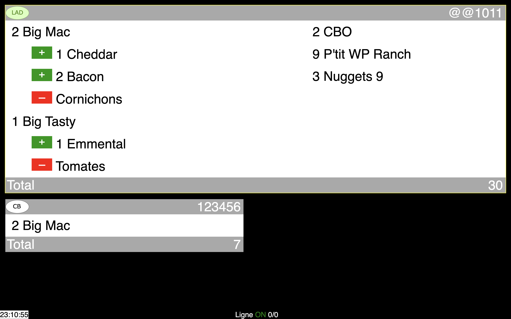
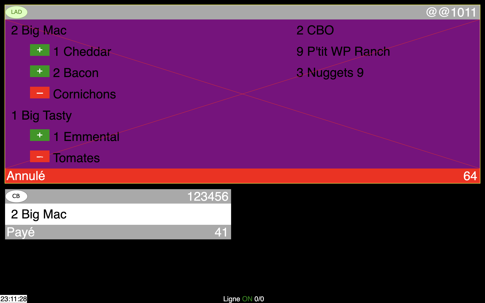
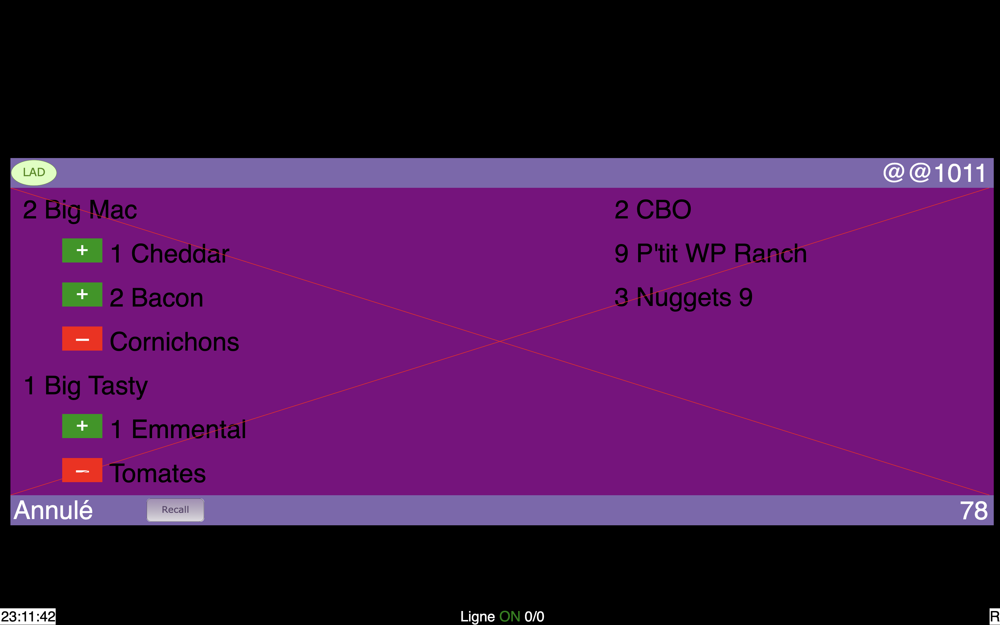

# OrderL1 System

OrderL1 is a server-client system built with Node.js and Socket.IO to manage and display orders in a restaurant or similar setting. The system allows for real-time communication between the server and clients, updating orders, and managing the state of the service line.

## Features

- **Real-time Communication**: Utilizes Socket.IO for real-time bidirectional event-based communication between the server and clients.
- **Order Management**: Clients can send orders to the server, and the server broadcasts them to all connected clients.
- **Line Status**: Clients can check and toggle the status of the service line (open or closed).
- **Order Bumping**: Clients can bump an order, moving it to a recalled state for easy tracking.

## Screenshots

  
  

  
  

  
  
  
  

  

  

  

## Usage

1. Install Node.js and npm.
2. Clone the repository.
3. Install dependencies with `npm install`.
4. Run the server with `npm start` or `node server.js`.
5. Access the client interface via a web browser.

## Server-Side Dependencies

- Express
- Body-parser
- http
- fs
- path
- socket.io

## Client-Side Dependencies

- jQuery
- Socket.IO client library

## Server API Endpoints

1. **`/api/send-message`**
   - *Method:* POST
   - *Description:* Accepts POST requests to send orders to the server.

2. **`/api/bump`**
   - *Method:* GET
   - *Description:* Accepts GET requests to bump an order.

3. **`/api/remove-command`**
   - *Method:* POST
   - *Description:* Accepts POST requests to remove a specific order.

4. **`/api/modify-state`**
   - *Method:* POST
   - *Description:* Accepts POST requests to modify the state of a command on the client side.
   
5. **`/api/cancel-command`**
   - *Method:* POST
   - *Description:* Accepts POST requests to cancel a specific command.

6. **`/api/get-command`**
   - *Method:* GET
   - *Description:* Accepts GET requests to retrieve the list of current orders.

7. **`/api/get-command-time`**
   - *Method:* GET
   - *Description:* Accepts GET requests to retrieve the timestamps of the current orders.

8. **`/api/onoff`**
   - *Method:* GET
   - *Description:* Accepts GET requests to toggle the status of the service line.

9. **`/api/next`**
   - *Method:* GET
   - *Description:* Accepts GET requests to move to the next order.

10. **`/api/recall`**
    - *Method:* GET
    - *Description:* Accepts GET requests to display recall bumped order.

11. **`/api/is-line-open`**
    - *Method:* GET
    - *Description:* Accepts GET requests to check if the line is open.

12. **`/api/reload`**
    - *Method:* GET
    - *Description:* Accepts GET requests to trigger a reload.

13. **`/api/remove-article`**
    - *Method:* POST
    - *Description:* Accepts POST requests to remove a specific article from an order.

14. **`/api/add-article`**
    - *Method:* POST
    - *Description:* Accepts POST requests to add a specific article to an order.

15. **`/api/get-command-number`**
    - *Method:* GET
    - *Description:* Accepts GET requests to retrieve the order number of the current command.

You can use this Postman collection bellow that includes a set of meticulously crafted API requests to streamline and test various functionalities of this application. Use this collection to effortlessly interact with the API, perform tests, and ensure seamless integration. Refer to the provided examples and adapt them to your needs.

## Client Side Script

The client-side script is written in JavaScript and uses jQuery for DOM manipulation and Socket.IO for real-time communication with the server.

## Keyboard Shortcuts

- **Enter Key (Return)**: Remove the selected order and bump it.
- **'n' Key**: Move to the next order.
- **'o' Key**: Toggle the status of the service line (open or closed).
- **'r' Key**: Recall a bumped order.

## Additional Notes

- The system provides a visual representation of the service line's status, current orders, and recalled orders.
- The server logs events such as user connections, disconnections, and changes in the service line status.

Feel free to use and modify the system based on your specific requirements. For any issues or improvements, please create an issue or pull request.

**Enjoy efficient order management with OrderL1!**
